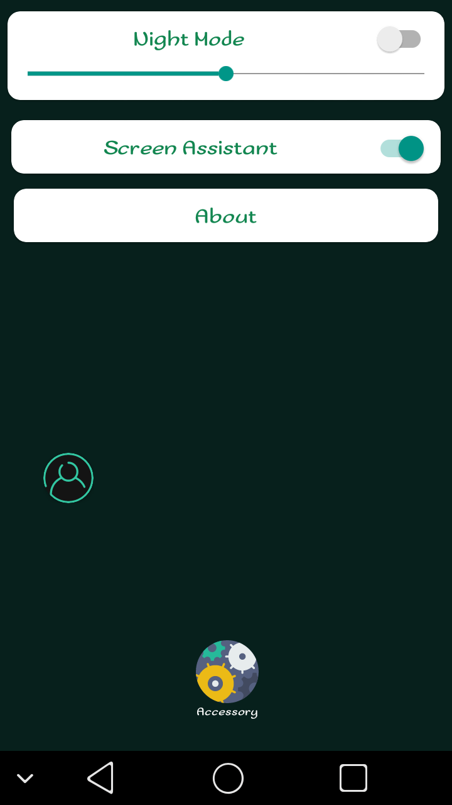
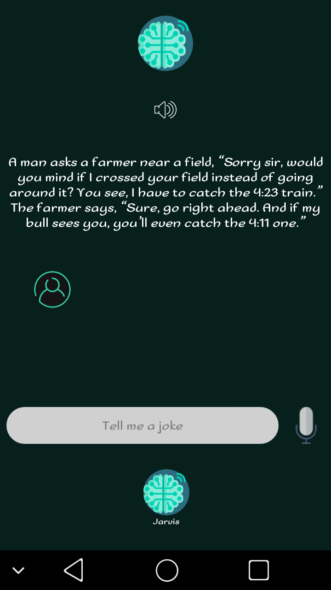
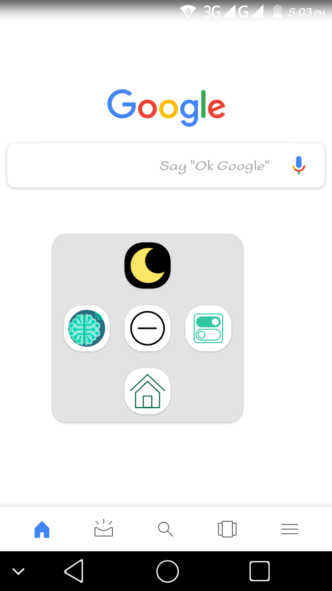

# :iphone: 3asy

## Features:
 * ### Accessories:
   * #### Night Light
   * #### Screen Assistant
 * ### Sharing:
   * #### Android to Android file sharing
   * #### Android to PC ( [IP Messenger](https://github.com/rafiulgits/IP-Messenger/releases) ) file sharing and controlling
 * ### Jarvis AI:
   * #### Jokes 
   * #### Ringer mode change
   * #### Ringer mode scheduler (example: silent for 30 minutes)
   * #### Support on screen assistant
   

## Supported library:
 * #### [Cursor Wheel Layout](https://github.com/BCsl/CursorWheelLayout)
 * #### [ Circle Image View ](https://github.com/hdodenhof/CircleImageView)
 * #### [Dialogflow](https://github.com/dialogflow/dialogflow-android-client)
 * #### [Folder Picker](https://github.com/kashifo/android-folder-picker-library)
 * #### [Licenser](https://github.com/marcoscgdev/Licenser)

***

## [Download APK](https://github.com/sakkhat/Project250/releases)

*** 

## Source Code License:
```
MIT License

Copyright (c) 2019 Sakkhat

Permission is hereby granted, free of charge, to any person obtaining a copy
of this software and associated documentation files (the "Software"), to deal
in the Software without restriction, including without limitation the rights
to use, copy, modify, merge, publish, distribute, sublicense, and/or sell
copies of the Software, and to permit persons to whom the Software is
furnished to do so, subject to the following conditions:

The above copyright notice and this permission notice shall be included in all
copies or substantial portions of the Software.

THE SOFTWARE IS PROVIDED "AS IS", WITHOUT WARRANTY OF ANY KIND, EXPRESS OR
IMPLIED, INCLUDING BUT NOT LIMITED TO THE WARRANTIES OF MERCHANTABILITY,
FITNESS FOR A PARTICULAR PURPOSE AND NONINFRINGEMENT. IN NO EVENT SHALL THE
AUTHORS OR COPYRIGHT HOLDERS BE LIABLE FOR ANY CLAIM, DAMAGES OR OTHER
LIABILITY, WHETHER IN AN ACTION OF CONTRACT, TORT OR OTHERWISE, ARISING FROM,
OUT OF OR IN CONNECTION WITH THE SOFTWARE OR THE USE OR OTHER DEALINGS IN THE
SOFTWARE.

```
***
## [Download 3asy app](https://github.com/sakkhat/Project250/releases)
## [Download IP Messenger](https://github.com/rafiulgits/IP-Messenger/releases)
***
## Samples:

   
